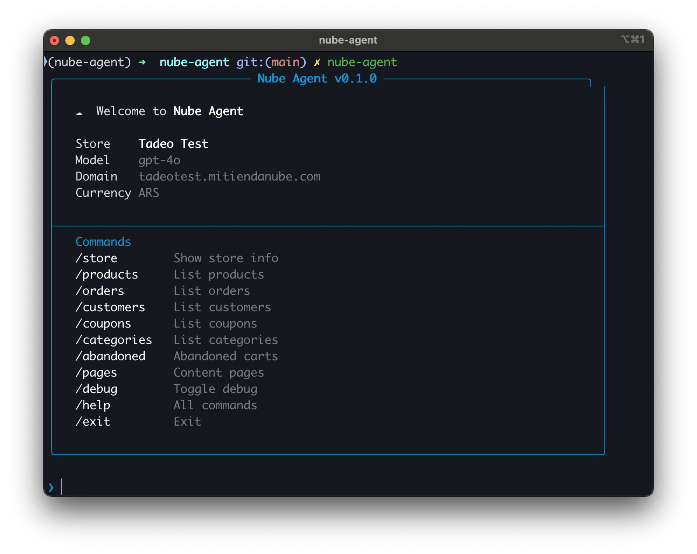

# Nube Agent

CLI conversational agent for managing [Nuvemshop/Tiendanube](https://www.tiendanube.com/) online stores using natural language.



> **Disclaimer:** This is NOT an official Nuvemshop/Tiendanube product. It is an independent project that uses the public Tiendanube API.

## Features

- **43 tools** across 10 domains: products, categories, variants, images, orders, customers, coupons, abandoned checkouts, pages, and store info
- **5 specialized sub-agents** that handle domain-specific tasks (catalog, orders, customers, marketing, content)
- **Human-in-the-loop** confirmation for destructive actions (delete, cancel)
- **Long-term memory** to persist preferences and context across conversations
- **8 skills** with structured API documentation for each domain
- **Streaming output** with real-time response rendering
- **Slash commands** for quick access to common operations
- **Debug mode** to inspect tool calls and arguments

## Requirements

- Python 3.11+
- Tiendanube API access token ([get one here](https://partners.nuvemshop.com.br/))
- OpenAI API key

## Installation

```bash
git clone https://github.com/your-user/nube-agent.git
cd nube-agent
pip install -e .
```

For development (tests + linting):

```bash
pip install -e ".[dev]"
```

## Configuration

Copy the example environment file and fill in your credentials:

```bash
cp .env.example .env
```

Required variables:

| Variable | Description |
|----------|-------------|
| `OPENAI_API_KEY` | Your OpenAI API key |
| `TIENDANUBE_ACCESS_TOKEN` | Tiendanube API access token |
| `TIENDANUBE_STORE_ID` | Your store's numeric ID |

## Usage

```bash
nube-agent
```

Start with debug mode:

```bash
nube-agent --debug
```

### Slash Commands

| Command | Description |
|---------|-------------|
| `/store` | Show store information |
| `/products` | List all products |
| `/orders` | List recent orders |
| `/customers` | List recent customers |
| `/coupons` | List discount coupons |
| `/categories` | List all categories |
| `/variants <id>` | List variants for a product |
| `/abandoned` | List abandoned checkouts |
| `/pages` | List content pages |
| `/debug` | Toggle debug mode |
| `/help` | Show all commands |
| `/exit` | Exit the agent |

Or just type naturally — the agent understands free-form requests like "create a product called Boca Juniors t-shirt at $5000" or "show me unpaid orders from last week".

## Available Tools

| Domain | Tools | Count |
|--------|-------|-------|
| Store | get_store_info | 1 |
| Products | list, get, create, update, delete | 5 |
| Categories | list, get, create, update, delete | 5 |
| Variants | list, get, create, update, delete, bulk_update_stock_price | 6 |
| Images | list, add, update, delete | 4 |
| Orders | list, get, update, close, open, cancel | 6 |
| Customers | list, get, create, update | 4 |
| Coupons | list, get, create, update, delete | 5 |
| Abandoned Checkouts | list, get | 2 |
| Pages | list, get, create, update, delete | 5 |

## API Permissions

Nube Agent requires your Tiendanube application to have the correct OAuth scopes for each domain it interacts with. If your app is missing scopes, some tools will return **403 Forbidden** errors.

To update scopes:

1. Go to **https://partners.tiendanube.com/applications/update/{app_id}** (replace `{app_id}` with your application ID)
2. Enable the required scopes
3. **Reinstall the app** on the store — updating scopes alone is not enough, the store must re-authorize for the new scopes to take effect

## Architecture

```
User Input
    │
    ▼
Main Agent (get_store_info + delegation)
    │
    ├─► catalog-manager   (products, categories, variants, images)
    ├─► order-manager     (orders)
    ├─► customer-manager  (customers)
    ├─► marketing-manager (coupons, abandoned checkouts)
    └─► content-manager   (pages)
```

- **Sub-agents**: Domain-specific agents handle tasks in their area of expertise
- **Human-in-the-loop**: Destructive tools (delete_product, cancel_order, etc.) require user confirmation before execution
- **Long-term memory**: The agent can persist notes and preferences to `/memories/` for cross-conversation context

## Development

Run tests:

```bash
pytest
```

Run linter:

```bash
ruff check src/ tests/
```

Run tests with coverage:

```bash
pytest --cov=nube_agent
```

## Contributing

1. Fork the repository
2. Create a feature branch (`git checkout -b feature/my-feature`)
3. Make your changes
4. Run tests and linting (`pytest && ruff check src/ tests/`)
5. Commit and push
6. Open a pull request

## License

MIT
